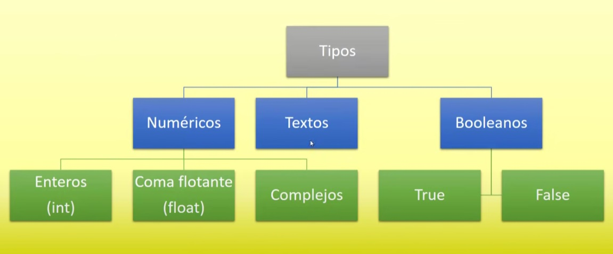
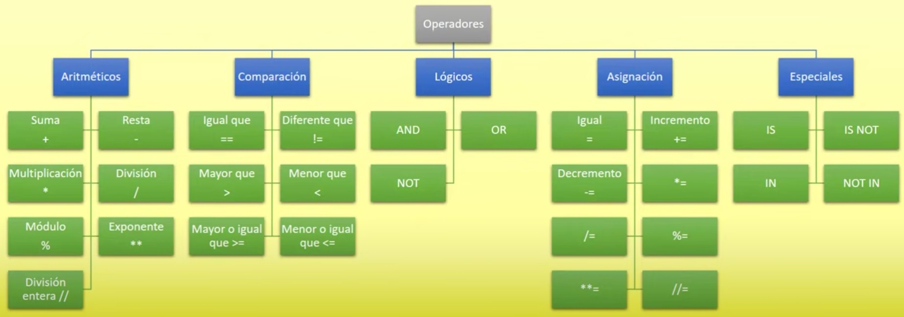
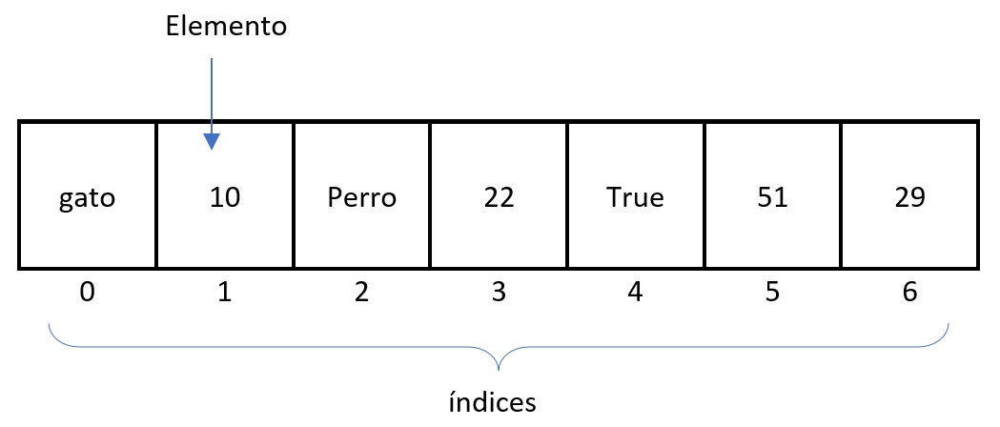

<center> <h1><strong>APUNTES PYTHON</strong></h1> </center>

## **Tipos**


## **Operadores**


---
## **FUNCIONES**


* Es un bloque de codigo que realiza una tarea especifica 
* Pueden tener (parametros/argumentos)
* Pueden devolver valores 
* Cuando estan dentro de una clase, se denominan **metodos**

**Utilidad:** Reutilizacion de codigo cuando se necesite

## **Sintaxis**

```py
#funcion sin retorno de valores 
def nombreFuncion():
    n1 = 10
    n2 = 20
    print("la suma es:",n1 + n2)
```
```py
#funsion con retorno de valores
def nombreFuncion():
    suma = 2+2
    return suma
```
```py
#funsion con parametros, tambien puede tener o no retorno de valores
def nombreFuncion(datoA, datoB):
    suma = datoA + datoB
    return suma
```
Para llamar a las funciones unicamente se coloca el nombre
```py
#sin parametros
nombreFuncion()
#con parametros
nombreFuncion(datoA,DatoB)
```

## **Uso extra**
- al anteponer un "*" en el parametro, se puede ingrear una cantidad indefinida de parametros que se registrarán comp tuplas
- solo se puede ingrear directo, si se ingresa una variable con tupla, se registrará como tupla de UN solo elemento
- Nota propia ("Me puede servir pero en un caso muy especifico [aun no se cual]")
```py
# el "*" hace que pueda almacenar una cantidad X de elementos como parametros
def prueba(*elementos):
    print(elementos)             -> imprimira tupla 
    for element in elementos:    -> imprimira uno por uno la tupla
        print(element)

prueba(1,2,3,4,"gato",True, "perro") 
```
---
## **Listas**
* Pueden ser llamados Vectores o Arrays en otros lenguajes de programación 
* En python, pueden guardar diferentes valores
* En python, se puede agregar o quitar datos de forma dinámica 

## **Sintaxis**
```py
nombreLista = [elemento1, elemento2, elemento3]

nombreLista = [1,2,3,4]

nombreLista = ["gato", 10, "Perro", 22, True, 51, 29]
```
## **Forma Gráfica**


## **Funcionamiento**

```py
listaPrueba = ["gato", "perro", "loro", 1, 2, 3]

#Imprimir una lista
print(listaPrueba)

#Imprimir un elemento en especifico 
print(listaPrueba[2])
```
Para imprimir un fragmento, el primero es inclusive, y el segundo exclusive
```py
#Imprimir unicamente una parte de la lista
print(listaPrueba[0,3])
```
para una lista que va desde numeros negativos, no hay indice 0 de regreso (inicia desde -1)
```py
#Imprimir unicamente una parte de la lista
print(listaPrueba[-3])
```
## **Operaciones con las listas**
```py
listaX = ["hola","mundo", 1, 2, 3, 4]

#convertir a tupla
tupla = tuple(listaX)

#agregando elemento
listaX.append("Luis")

#insertando elemento
listaX.insert(2,"Julia")

#uniendo dos listas
listaX.extend([5, 6, 7])

#averiguar el indice de un elemento
listaX.index("mundo")

#saber si un elemento existe dentro de la lista
print("mundo" in listaX)  --> imprimira True o False

#remover un elemento 
listaX.remove("mundo")

#eliminar el ultimo elemento de una lista
listaX.pop()
```
---
## **TUPLAS**
Son listas inmutables (no se pueden modificar despues de su creación)
* No se puede: añadir, eliminar, o mover elementos
* Si se puede extraer porciones (el resultado es una  tupla)
* Si perminte buscar si existe un elemento dentro de ella

## **Utilidad**
- más rapidas
- menos espacio (mayor optimización)
- Formatean strings
- Pueden utilizarse como claves en un diccionario (las listas no)

## **Sintaxis**
```py
nombreTupla = (elemento1, elemento2, elemento3)

nombreTupla = (1,2,3,4)

nombreTupla = ("gato", 10, "Perro", 22, True, 51, 29)
```
## **Funcionamiento**
```py
tuplaEjemplo = ("gato", 10, "Perro", 22, True, 51, 29)

#convertir tupla a lista
lista = list(tuplaEjemplo)  

#ver si un elemento se encuentra dentro de la tupla
print("gato" in tuplaEjemplo) -> devuelve un booleano

#contar cuantas veces aparece un elemento dentro de la tupla
cantidad = tuplaEjemplo.count("perro")

#averiguar el tamaña de la tupla
tamaño = len(tuplaEjemplo)

#desempaquetado de tupla (cada variable agarra un valor de la tupla)
a, b, c, d, e, f, g = tuplaEjempllo
```
---
## **DICCIONARIOS**
Es una extructura que nos permite almacenar valores de diferentes tipos, tales como: enteros, cadenas, decimales, listas, tuplas y otros dicionarios

- son de tipo **clave : valor**
- los elementos almacenados, no estan ordenados 

## **Sintaxis**
```py
nomDiccionario = {"Alemania":"Berlin", "Francia":"Paris", "España":"Madrid"}

#para obtener un valor
valor = nomDiccionario["Alemania"]
```

## **Funcionamiento**
```py
nomDiccionario = {"Alemania":"Berlin", "Francia":"Paris", "España":"Madrid"}

#agregar un nuevo elemento
nomDiccionario["Guatemala"] = "Guate"

#modificar un valor ya existente
nomDiccionario["Guatemala"] = "Guatemala"

#Eliminar un valor
del nomDiccionario["Francia"]

#saber las claves del diccionario
print(nomDiccionario.keys())

#saber los valores del diccionario
print(nomDiccionario.values())

#tamaño del diccionario
tamaño = len(nomDiccionario)
```

---
## **CONDICIONAL IF**
En las condiciones pueden ir:
- operadores de comparacion
- operadores logicos
- operadores especiales
## **Sintaxis**
```py
if condicion:
    instruccines
elif condicion:
    instruccioens
else:
    instrucciones
```
---
## **BUCLE FOR**
Es un bucle determinado, ya que se sabe cuantas veces se ejecutara desde un inicio.

## **Sintaxis**
Recorriendo un objeto: la variable "i" imprimira los valores de la lista
```py
#recorriendo un objeto
for i in lista:
    print(i)  
```
Recorriendo un rango: la variable "i" imprimira los valores de 0 hasta el rango final (-1)
```py
range: genera una lista, segun el rango

#recorriendo con range (un valor)
for i in range(10):
    print(i)  
```
Se pueden agregar 3 valores al range (i, j, k) 
- i = valor de inicio
- j = valor final
- k = de cuanto en cuato avanzará

al crear una lista con range, si se usan los parametros j,k. entonces i imprimira los volores de ese nueva lista creada segun los parametros.
```py
for i in range(5, 20)
    print(i)

for i in range(5,20,2)
    print(i)
```
---
## **BUCLE WHILE**
Es un bucle inteterminado, ya que no se sabe cuantas veces se ejecutará
## **Sintaxis**
```py
while condicion
    cuerpo del bucle 
```
---
## **CONTINUE, PASS, BREAK, ELSE**
## **continue**
Nos ayudara cuando querramos saltar una iteracion dada una condición.

```py
#contador de letras sin espacio en blanco
saludo = "hola mundo"
contador = 0

for i in saludo:
    if i == " ":
        continue      -> el bucle hace un salto e inicia de nuevo 
    contador += 1     -> si entro en el continue, no leera esta línea
print(contador)
```
## **pass**
Esto nos ayudara cuando querramos dejar una instrucción pendiente y no queremos que nos salte un error (mayormente usado para eso)
```py
if x == 1:
    prrint("hola")
elif x == 2:
    pass
elif x == 3: 
    print("hola tambien")
else:
    print("Hi!")
```

## **break**
esta palabra reservada nos ayudara a terminar la ejecución de un bucle 
```py
#Cuando encuentre un espacio en blanco, cortara la ejecución del bucle

saludo = "hola mundo"

for i in saludo:
    if i == " ":
        break;  
    print(i)
```

## **else**
- else pasa a ser parte del bucle for al igual que con IF
- Cuando se usa con el bucle for, se ejecutara cuando el bucle haya terminado toda su ejecución. 
- Si el bucle fue terminado prematuramente con un break, no ejecutara
```py
# determinando si hay un espacio en blanco
# El else se ejecutara cuando no hayan espacion en blanco 

saludo1 = "Hola Mundo"       -> con este NO se ejecutara el else
salodo2 = "HolaMundo"        -> con este SI se ejecutara el else

for i in saludo2:
    if i == " ":
        break;  
    print(i)
else:
    print("Completado")
```

---
## **GENERADORES**
- Eficiente para grantes conteos 
- Para llevar el control sin importar el flujo del programa 
- Al no ser usado, el generador entra en un estado de pausa
- Al quedar en pausa no consume memoria hasta que se le llama de nuevo
```py
# Funcion generadora de numeros pares
def generarPares(limite):
    num = 1
    while num < limite:
        yield num * 2
        num += 1

# Variable que almacenara los numeros 
paresConYield = generarPares(10)


# Utilizando los numeros sin importar si existe codigo de por medio
print("Codigo")
print(next(paresConYield))
print("Codigo")
print(next(paresConYield))
print("Codigo")
print(next(paresConYield))
```
---
## **EXCEPCIONES**
- Son errores que ocurren durante la ejecución de un programa
- Ayudan cuando la sintaxis del codigo es correcta, pero ocurre algo "inesperado"
- Controla los errores para que la ejecución del programa continue 
- Se conoce como **Manejo o control de excepciones**

## **Tipos de errores más comunes**
- **TypeError:**  Ocurre cuando se aplica una operación o función a un dato del tipo inapropiado.
- **ZeroDivisionError:** Ocurre cuando se itenta dividir por cero.
- **OverflowError :** Ocurre cuando un cálculo excede el límite para un tipo de dato numérico.
- **IndexError :** Ocurre cuando se intenta acceder a una secuencia con un índice que no existe.
- **KeyError :** Ocurre cuando se intenta acceder a un diccionario con una clave que no existe.
- **FileNotFoundError :** Ocurre cuando se intenta acceder a un fichero que no existe en la ruta indicada.
- **ImportError :** Ocurre cuando falla la importación de un módulo.

## **Sintaxis**
- Puede tener varios **"except"**: python detectara cual es
- el **"tipo de error"** no es obligatorio
- el **"Return"** no es obligatorio
- el finally se ejucatara SIEMPRE
```py

try:
    codigo
    CODIGO
    codigo
except tipoError:      #tipo de error no obligatorio
    print("Mensaje de error")
    return "Retorno de mensaje de error"  #Return no obligatorio
except tipoError: 
    print("Otro tipo de error")
    return "Otro retorno de mensaje de error"
finally:
    codigo      #Este codigo se ejecutara "Siempre" 
    CODIGO
```
--- 

<center> <h1><strong>POO</strong></h1> </center>

Programaion Orientada a Objetos 
## **Palabras clave**
- Clase
- Objeto
- Instancia o instanciar una clase
- Modularización
- Encapsular o encapuslamiento
- Herencia
- Polimorfismo

## **Sintaxis**
```
CLASE BASE
```
```py
# creando la clase Carro
class Auto():
    color = "Azul"
    llantas = 4
    encendido = False
    conbustible = "gasolina"

    def arrancar(self):
        self.encendido = True
    
    def estado(self):
        if (self.encendido == True):
            return "El auto esta encendodo"
        else:
            return "El auto esta apagado"

# "miAuto" es una instancia... se esta instanciando el "Auto"
miAuto = Auto()
print("El color del carro es:", miAuto.color)
print(miAuto.estado())
```
```
CLASE CON PARAMETROS Y ATRIBUTOS ENCAPSULADOS(Protegidos)
```
```py
# creando la clase Carro
class Auto():
    color = "Azul"      #Modificable desde fuera de la clase
    __llantas = 4       #Modificable solo desde la propia clase
    __enMarcha = False  #Modificable solo desde la propia clase

    def arrancar(self, enMarcha):
        self.__enMarcha = enMarcha


    def estado(self):
        print("Cantidad de llantas: ", self.__llantas)
        print("Color del auto: ", self.color)
        if self.__enMarcha:
            print("el auto esta en marcha")
        else:
            print("el auto esta parado")

#Creando las instancias
miAuto1 = Auto()
miAuto2 = Auto()

#utilizamos los metodos de la instancia creada
miAuto1.arrancar(True)
miAuto1.estado()
print("========")
miAuto2.arrancar(False)
miAuto2.estado()
```

```
HERENCIA SIMPLE
```
```py
class Vehiculos():
    def __init__(self,marca,modelo):
        self.marca = marca
        self.modelo = modelo
        self.enMarcha = False
        self.acelera = False
        self.frena = False

    def arrancar(self):
        self.enMarcha = True
    def acelerar(self):
        self.accelera = True
    def frenar(self):
        self.frena = True

    def estado(self):
        print(f"""
        Marca: {self.marca}
        Modelo: {self.modelo}
        En marcha: {self.enMarcha}
        Acelera: {self.acelera}
        Frena: {self.frena}
        """)

# Heredando de la clase super Padre "Vehiculos"
class Moto(Vehiculos):
    pass

miMoto = Moto("Suzuki", "FN125")
miMoto.estado()
```
```
HERENCIA MULTIPLE
```
```py
#Clase independiente
class Vehiculos():
    def __init__(self,marca,modelo):
        self.marca = marca
        self.modelo = modelo
        self.enMarcha = False
        self.acelera = False
        self.frena = False

    def arrancar(self):
        self.enMarcha = True
    def acelerar(self):
        self.acelera = True
    def frenar(self):
        self.frena = True

    def estado(self):
        print(f"""
        Marca: {self.marca}
        Modelo: {self.modelo}
        En marcha: {self.enMarcha}
        Acelera: {self.acelera}
        Frena: {self.frena}
        """)

#Clase independiente
class VehiculosElectricos():
    def __init__(self) -> None:
        self.autonomia = 100
    def cargarEnergia(self):
        self.cargando = True

# Heredando de la clase "Vehiculos"
class Furgoneta(Vehiculos):
    def carga(self, cargar):
        self.cargado = cargar
        if self.cargado:
            return "La furgoneta esta cargada"
        else:
            return "La furnoneta no esta cargada"

# Heredando de la clase "Vehiculos"
class Moto(Vehiculos):
    haceCaballito = "No hace el caballito"
    def caballito(self):
        self.haceCaballito = "Voy haciendo caballito"

    #Se sobre escribe el metodo de la clase "Vehiculos"
    def estado(self):
        print(f"""
        Marca: {self.marca}
        Modelo: {self.modelo}
        En marcha: {self.enMarcha}
        Acelera: {self.acelera}
        Frena: {self.frena}
        caballito: {self.haceCaballito}
        """)

# Utilizando herencia multiple
# El constructor heredado sera de "VehiculosElectricos"
# Siempre se heredara del primero colocado
# Si existen metodos iguales, se heredaran del primero colocado tambien
class BicicletaElectica(VehiculosElectricos,Vehiculos):
    pass

#instanciando de Moto
miMoto = Moto("Suzuki", "FN125")
miMoto.frenar()
miMoto.estado()

#instanciando de Furgoneta
miFurgoneta = Furgoneta("Toyota", "MDU22")
miFurgoneta.acelerar()
miFurgoneta.estado()

#instanciando de BicicletaElectrica
miBicicleta = BicicletaElectica()
miBicicleta.cargarEnergia()
print(miBicicleta.cargando)
```


